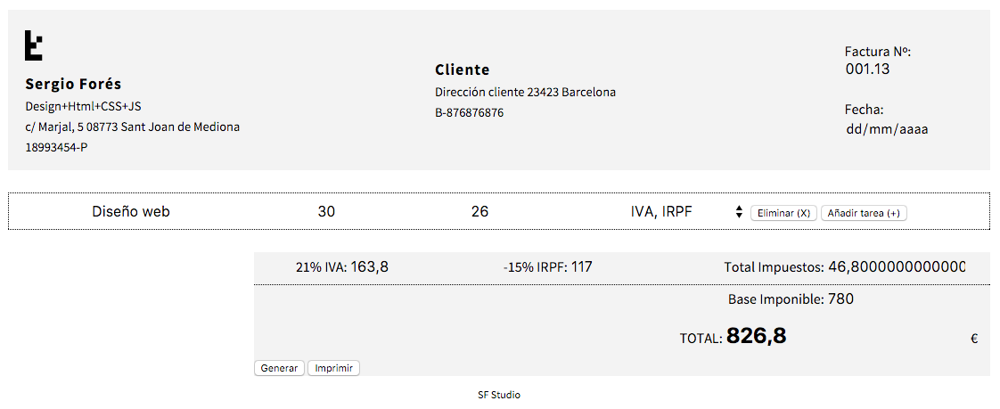

# SSPIA
**Static Single Page Invoice Application** that uses Web Standards.

## Raw Standards

  - HTML
  - JS/ES6
    - Modules
    - Classes
  - CSS
  - SASS
    - Components
    - BEM
  - [The DOM](https://developer.mozilla.org/en-US/docs/Web/API/Document_Object_Model)
  - JSON as "DB"

## Development

 * Atom
 * Git
 * Gulp tasks & NPM:
  - Deploy to gh-pages
  - Watch
  - Babel
  - BrowserSync
  - Autoprefixer

## To Do

- [] Añadir Tarea
- [] Eliminar Tarea
- [] Añadir Imprimir
- [x] Select con impuestos o sin
- [] JSON as Db
